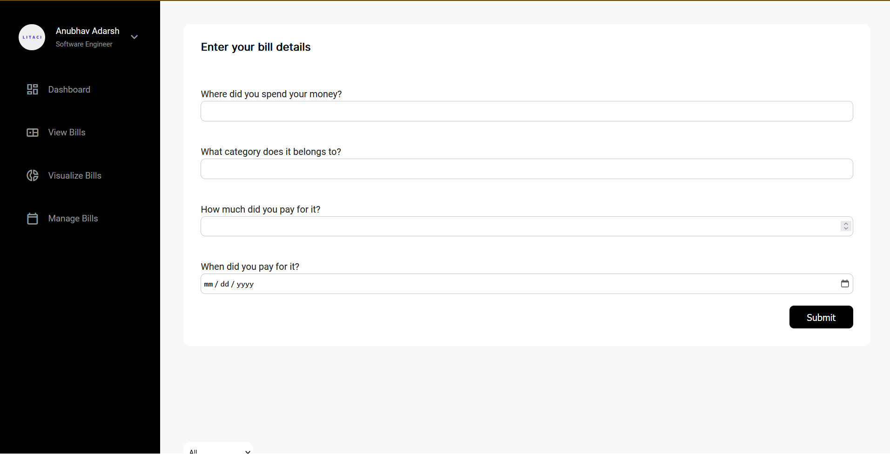
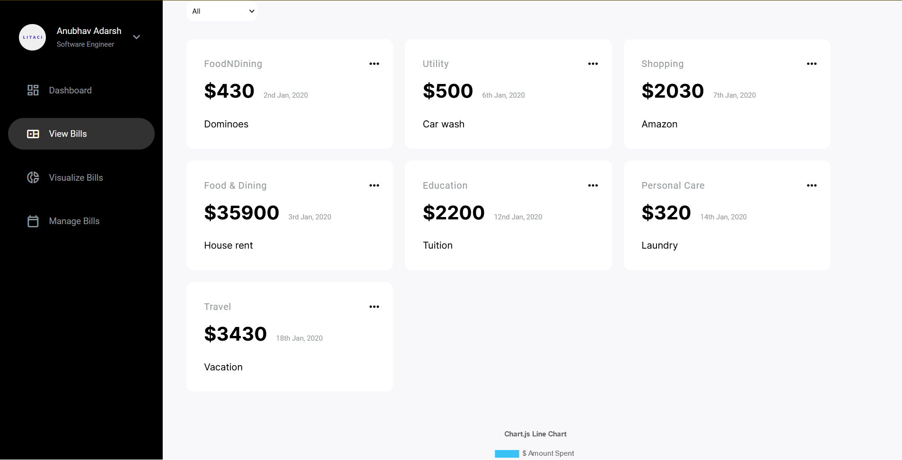
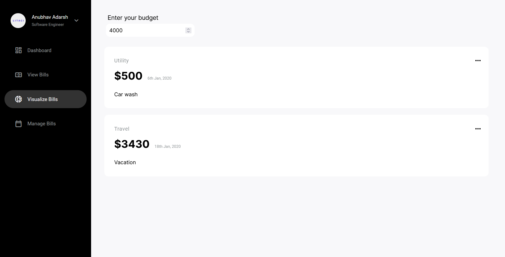

# Spendr

## Highlights

- Architected a modern design and implemented error handling and feedback mechanisms for the bill creation form, providing a seamless user experience.

  

- Devised a management dashboard for the bills, including filtering, editing, and deletion functionalities, resulting in better bill organization and management.

  

- Engineered a budget feature that recommends bills to pay based on the user’s budget, resulting in sound financial planning and management.

  
